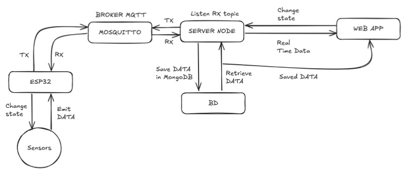

# HydroMasters

This project implements an IoT system that monitors water temperature, total dissolved solids (TDS), and a liquid level sensor (LLS) while controlling water and air pumps. It uses an ESP32 microcontroller with various peripherals to gather data, display information, and respond to MQTT messages.

## Features
* **WiFi Connectivity**: Connects to WiFi and communicates with an MQTT broker.
* **Sensors**: Reads water temperature, TDS levels, and liquid level sensor data.
* **Pump Control**: Controls water and air pumps based on sensor data and MQTT commands.
* **Data Storage**: Saves data locally on an SD card when offline.
* **Display**: Shows the current date and time on an LCD.
* **RTC Integration**: Uses a DS1307 RTC module to maintain accurate time.
* **MQTT Integration**: Publishes sensor data and receives commands for pump control.

## Components
### Hardware
* **ESP32**: Main microcontroller.
* **DS1307 RTC**: Real-Time Clock for date and time.
* **LiquidCrystal I2C**: LCD display (16x2).
* **Water Temperature Sensor**: Measures water temperature using a DallasTemperature sensor.
* **TDS Sensor**: Measures total dissolved solids.
* **Liquid Level Sensor (LLS)**: Detects water levels.
* **Relays**: Control water and air pumps.
* **MicroSD Module**: Stores data locally when offline.

## Software
### Libraries
* `WiFi.h`: Handles WiFi connectivity.
* `PubSubClient.h`: Manages MQTT communication.
* `ArduinoJson.h`: Handles JSON serialization/deserialization.
* `DallasTemperature.h`: Reads temperature from the sensor.
* `LiquidCrystal_I2C.h`: Controls the I2C LCD.
#### Custom libraries:
* `Relay.h`: https://github.com/hanzeelvilla/Relay
* `DS1307_RTC.h`: https://github.com/hanzeelvilla/RTC
* `TDS.h`: https://github.com/hanzeelvilla/TDS
* `MicroSD.h`: https://github.com/hanzeelvilla/MicroSD

## Server
https://github.com/hanzeelvilla/serverHydroponicSystem